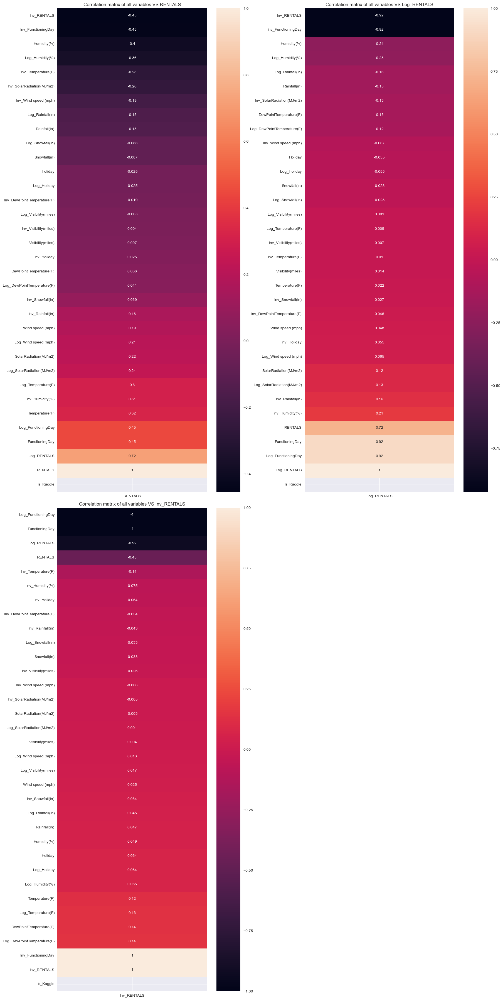

# Linear Modeling Case Study

This script contains a machine learning model that predicts the number of bikes rentals started at a given hour for the Chicago Cook County Planning and Development Department.

I employed data analytics and machine learning techniques to predict the number of bike rentals given a set of explanatory variables. It was evident that the 2 most important factors for predicting rentals were the hour of day and the weather conditions (specifically temperature and humidity).

The store was not functioning during some hours so rentals would be 0. Delegating this task to a simple algorithm rather than trusting the machine learning algorithms to discover this relationship helped to improve accuracy significantly.

I imported all data, filled missing values, applied transformations, visualized the data, developed multiple models, and tuned the hyper parameters using GridSearchCV. The final model had an r-square of about 0.80 which means we can explain about 80% of the variations in the data.

## Imports and Data Checks


```python
import pandas as pd
import matplotlib.pyplot as plt
import seaborn as sns
import math
import numpy as np
import random

from sklearn.pipeline import Pipeline
from sklearn.model_selection import train_test_split
from sklearn.metrics import r2_score
from sklearn.impute import KNNImputer
from sklearn.linear_model import LinearRegression, Lasso, Ridge, SGDRegressor
from sklearn.neighbors import KNeighborsRegressor
from sklearn.tree import DecisionTreeRegressor, plot_tree
from sklearn.preprocessing import StandardScaler
from sklearn.model_selection import GridSearchCV

# draw plots inlint
%matplotlib inline 

plt.style.use(style = 'seaborn-v0_8') # set plot styles

# set pandas print options
pd.set_option('display.max_rows', 500)
pd.set_option('display.max_columns', 500)
pd.set_option('display.width', 1000)
```


```python
# load data from excel
train_df = pd.read_excel(io = './datasets/train.xlsx')
test_df = pd.read_excel(io = './datasets/test.xlsx')

# separate Kaggle data
train_df['Is_Kaggle'] = True
test_df ['Is_Kaggle'] = False

merged_df = pd.concat([train_df, test_df], axis=0, ignore_index=True) # merge data frames

y_variable = 'RENTALS'
LOG_PREFIX = 'Log_'
INV_PREFIX = 'Inv_'
log_y_variable = LOG_PREFIX + y_variable
inv_y_variable = INV_PREFIX + y_variable # variable to predict
```


```python
merged_df.head() # check merged data frame
```


<div>
<style scoped>
    .dataframe tbody tr th:only-of-type {
        vertical-align: middle;
    }

    .dataframe tbody tr th {
        vertical-align: top;
    }

    .dataframe thead th {
        text-align: right;
    }
</style>
<table border="1" class="dataframe">
  <thead>
    <tr style="text-align: right;">
      <th></th>
      <th>ID</th>
      <th>DateHour</th>
      <th>Temperature(F)</th>
      <th>Humidity(%)</th>
      <th>Wind speed (mph)</th>
      <th>Visibility(miles)</th>
      <th>DewPointTemperature(F)</th>
      <th>Rainfall(in)</th>
      <th>Snowfall(in)</th>
      <th>SolarRadiation(MJ/m2)</th>
      <th>Holiday</th>
      <th>FunctioningDay</th>
      <th>RENTALS</th>
      <th>Is_Kaggle</th>
    </tr>
  </thead>
  <tbody>
    <tr>
      <th>0</th>
      <td>mb_1039</td>
      <td>2023-10-14 05:59:54.810000</td>
      <td>52</td>
      <td>81</td>
      <td>0.4</td>
      <td>2.9</td>
      <td>46.4</td>
      <td>0.0</td>
      <td>0.0</td>
      <td>0.00</td>
      <td>No</td>
      <td>Yes</td>
      <td>519.0</td>
      <td>True</td>
    </tr>
    <tr>
      <th>1</th>
      <td>mb_1330</td>
      <td>2023-10-26 08:59:53.355000</td>
      <td>51</td>
      <td>53</td>
      <td>2.2</td>
      <td>NaN</td>
      <td>35.2</td>
      <td>0.0</td>
      <td>0.0</td>
      <td>1.01</td>
      <td>No</td>
      <td>Yes</td>
      <td>1251.0</td>
      <td>True</td>
    </tr>
    <tr>
      <th>2</th>
      <td>mb_551</td>
      <td>2023-09-23 21:59:57.250000</td>
      <td>56</td>
      <td>49</td>
      <td>2.5</td>
      <td>3.4</td>
      <td>38.8</td>
      <td>0.0</td>
      <td>0.0</td>
      <td>0.00</td>
      <td>No</td>
      <td>Yes</td>
      <td>1685.0</td>
      <td>True</td>
    </tr>
    <tr>
      <th>3</th>
      <td>mb_2103</td>
      <td>2023-12-19 14:00:00</td>
      <td>69</td>
      <td>32</td>
      <td>9.8</td>
      <td>12.4</td>
      <td>38.7</td>
      <td>0.0</td>
      <td>0.0</td>
      <td>2.36</td>
      <td>No</td>
      <td>No</td>
      <td>0.0</td>
      <td>True</td>
    </tr>
    <tr>
      <th>4</th>
      <td>mb_1430</td>
      <td>2023-10-30 12:59:52.855000</td>
      <td>53</td>
      <td>20</td>
      <td>2.9</td>
      <td>10.8</td>
      <td>12.9</td>
      <td>0.0</td>
      <td>0.0</td>
      <td>1.96</td>
      <td>No</td>
      <td>Yes</td>
      <td>814.0</td>
      <td>True</td>
    </tr>
  </tbody>
</table>
</div>


```python
train_df.head() # check train
```


<div>
<style scoped>
    .dataframe tbody tr th:only-of-type {
        vertical-align: middle;
    }

    .dataframe tbody tr th {
        vertical-align: top;
    }

    .dataframe thead th {
        text-align: right;
    }
</style>
<table border="1" class="dataframe">
  <thead>
    <tr style="text-align: right;">
      <th></th>
      <th>ID</th>
      <th>DateHour</th>
      <th>Temperature(F)</th>
      <th>Humidity(%)</th>
      <th>Wind speed (mph)</th>
      <th>Visibility(miles)</th>
      <th>DewPointTemperature(F)</th>
      <th>Rainfall(in)</th>
      <th>Snowfall(in)</th>
      <th>SolarRadiation(MJ/m2)</th>
      <th>Holiday</th>
      <th>FunctioningDay</th>
      <th>RENTALS</th>
      <th>Is_Kaggle</th>
    </tr>
  </thead>
  <tbody>
    <tr>
      <th>0</th>
      <td>mb_1039</td>
      <td>2023-10-14 05:59:54.810000</td>
      <td>52</td>
      <td>81</td>
      <td>0.4</td>
      <td>2.9</td>
      <td>46.4</td>
      <td>0.0</td>
      <td>0.0</td>
      <td>0.00</td>
      <td>No</td>
      <td>Yes</td>
      <td>519</td>
      <td>True</td>
    </tr>
    <tr>
      <th>1</th>
      <td>mb_1330</td>
      <td>2023-10-26 08:59:53.355000</td>
      <td>51</td>
      <td>53</td>
      <td>2.2</td>
      <td>NaN</td>
      <td>35.2</td>
      <td>0.0</td>
      <td>0.0</td>
      <td>1.01</td>
      <td>No</td>
      <td>Yes</td>
      <td>1251</td>
      <td>True</td>
    </tr>
    <tr>
      <th>2</th>
      <td>mb_551</td>
      <td>2023-09-23 21:59:57.250000</td>
      <td>56</td>
      <td>49</td>
      <td>2.5</td>
      <td>3.4</td>
      <td>38.8</td>
      <td>0.0</td>
      <td>0.0</td>
      <td>0.00</td>
      <td>No</td>
      <td>Yes</td>
      <td>1685</td>
      <td>True</td>
    </tr>
    <tr>
      <th>3</th>
      <td>mb_2103</td>
      <td>2023-12-19 14:00:00</td>
      <td>69</td>
      <td>32</td>
      <td>9.8</td>
      <td>12.4</td>
      <td>38.7</td>
      <td>0.0</td>
      <td>0.0</td>
      <td>2.36</td>
      <td>No</td>
      <td>No</td>
      <td>0</td>
      <td>True</td>
    </tr>
    <tr>
      <th>4</th>
      <td>mb_1430</td>
      <td>2023-10-30 12:59:52.855000</td>
      <td>53</td>
      <td>20</td>
      <td>2.9</td>
      <td>10.8</td>
      <td>12.9</td>
      <td>0.0</td>
      <td>0.0</td>
      <td>1.96</td>
      <td>No</td>
      <td>Yes</td>
      <td>814</td>
      <td>True</td>
    </tr>
  </tbody>
</table>
</div>


```python
test_df.head() # check test
```


<div>
<style scoped>
    .dataframe tbody tr th:only-of-type {
        vertical-align: middle;
    }

    .dataframe tbody tr th {
        vertical-align: top;
    }

    .dataframe thead th {
        text-align: right;
    }
</style>
<table border="1" class="dataframe">
  <thead>
    <tr style="text-align: right;">
      <th></th>
      <th>ID</th>
      <th>DateHour</th>
      <th>Temperature(F)</th>
      <th>Humidity(%)</th>
      <th>Wind speed (mph)</th>
      <th>Visibility(miles)</th>
      <th>DewPointTemperature(F)</th>
      <th>Rainfall(in)</th>
      <th>Snowfall(in)</th>
      <th>SolarRadiation(MJ/m2)</th>
      <th>Holiday</th>
      <th>FunctioningDay</th>
      <th>Is_Kaggle</th>
    </tr>
  </thead>
  <tbody>
    <tr>
      <th>0</th>
      <td>mb_382</td>
      <td>2023-09-16 20:59:58.095000</td>
      <td>73</td>
      <td>70</td>
      <td>5.6</td>
      <td>9.8</td>
      <td>65.7</td>
      <td>0.0</td>
      <td>0.0</td>
      <td>0.00</td>
      <td>No</td>
      <td>Yes</td>
      <td>False</td>
    </tr>
    <tr>
      <th>1</th>
      <td>mb_547</td>
      <td>2023-09-23 17:59:57.270000</td>
      <td>63</td>
      <td>39</td>
      <td>2.2</td>
      <td>2.5</td>
      <td>39.0</td>
      <td>0.0</td>
      <td>0.0</td>
      <td>0.21</td>
      <td>No</td>
      <td>Yes</td>
      <td>False</td>
    </tr>
    <tr>
      <th>2</th>
      <td>mb_578</td>
      <td>2023-09-25 00:59:57.115000</td>
      <td>69</td>
      <td>54</td>
      <td>0.2</td>
      <td>8.6</td>
      <td>48.6</td>
      <td>0.0</td>
      <td>0.0</td>
      <td>0.00</td>
      <td>No</td>
      <td>Yes</td>
      <td>False</td>
    </tr>
    <tr>
      <th>3</th>
      <td>mb_187</td>
      <td>2023-09-08 17:59:59.070000</td>
      <td>69</td>
      <td>43</td>
      <td>4.0</td>
      <td>6.2</td>
      <td>46.9</td>
      <td>0.0</td>
      <td>0.0</td>
      <td>0.26</td>
      <td>Yes</td>
      <td>Yes</td>
      <td>False</td>
    </tr>
    <tr>
      <th>4</th>
      <td>mb_227</td>
      <td>2023-09-10 09:59:58.870000</td>
      <td>75</td>
      <td>73</td>
      <td>6.9</td>
      <td>12.3</td>
      <td>64.2</td>
      <td>0.0</td>
      <td>0.0</td>
      <td>2.28</td>
      <td>No</td>
      <td>Yes</td>
      <td>False</td>
    </tr>
  </tbody>
</table>
</div>


## Data Preparation

### Handle missing values


```python
merged_df.isna().sum() # check missing values
```


    ID                          0
    DateHour                    0
    Temperature(F)              0
    Humidity(%)                 0
    Wind speed (mph)            0
    Visibility(miles)          76
    DewPointTemperature(F)     67
    Rainfall(in)                0
    Snowfall(in)                0
    SolarRadiation(MJ/m2)     106
    Holiday                     0
    FunctioningDay              0
    RENTALS                   546
    Is_Kaggle                   0
    dtype: int64


#### <i>Finding:</i>

- ```Visibility(miles)```, ```DewPointTemperature(F)```, and ```SolarRadiation(MJ/m2)``` have missing values. They are all continuous variables so we can easily impute a central tendency. We can refine our approach by using KNNImputer to impute the most likely value based on similar data points.


```python
# remove numeric missing values
numeric_columns = merged_df.select_dtypes(include='number').columns
numeric_columns = numeric_columns.drop('RENTALS') # no need to impute rentals
numeric_merged_df = merged_df[numeric_columns]

imputer = KNNImputer(n_neighbors=12, weights='uniform', metric='nan_euclidean')
filled_merged_df = pd.DataFrame(imputer.fit_transform(numeric_merged_df), columns=numeric_columns) # impute

merged_df[numeric_columns] = filled_merged_df[numeric_columns]

merged_df.isna().sum() # check data frame again
```


    ID                          0
    DateHour                    0
    Temperature(F)              0
    Humidity(%)                 0
    Wind speed (mph)            0
    Visibility(miles)           0
    DewPointTemperature(F)      0
    Rainfall(in)                0
    Snowfall(in)                0
    SolarRadiation(MJ/m2)       0
    Holiday                     0
    FunctioningDay              0
    RENTALS                   546
    Is_Kaggle                   0
    dtype: int64


#### *Finding:*

- No more missing data

### Handle Data Types


```python
merged_df.info() # check data
```

    <class 'pandas.core.frame.DataFrame'>
    RangeIndex: 2184 entries, 0 to 2183
    Data columns (total 14 columns):
     #   Column                  Non-Null Count  Dtype  
    ---  ------                  --------------  -----  
     0   ID                      2184 non-null   object 
     1   DateHour                2184 non-null   object 
     2   Temperature(F)          2184 non-null   float64
     3   Humidity(%)             2184 non-null   float64
     4   Wind speed (mph)        2184 non-null   float64
     5   Visibility(miles)       2184 non-null   float64
     6   DewPointTemperature(F)  2184 non-null   float64
     7   Rainfall(in)            2184 non-null   float64
     8   Snowfall(in)            2184 non-null   float64
     9   SolarRadiation(MJ/m2)   2184 non-null   float64
     10  Holiday                 2184 non-null   object 
     11  FunctioningDay          2184 non-null   object 
     12  RENTALS                 1638 non-null   float64
     13  Is_Kaggle               2184 non-null   bool   
    dtypes: bool(1), float64(9), object(4)
    memory usage: 224.1+ KB


#### <i>Finding:</i>

- ```DateHour``` can be Python datetime object
- ```Holiday``` and ```FunctioningDay``` can be int (0 and 1)


```python
# convert DateHour to datetime object
merged_df['DateHour'] = pd.to_datetime(
    merged_df['DateHour'],
    format = 'ISO8601'
)

# convert Holiday and FunctioningDay to int
merged_df['Holiday'] = merged_df['Holiday'].map({'Yes': 1, 'No': 0})
merged_df['FunctioningDay'] = merged_df['FunctioningDay'].map({'Yes': 1, 'No': 0})
```


```python
merged_df.info() # check again
```

    <class 'pandas.core.frame.DataFrame'>
    RangeIndex: 2184 entries, 0 to 2183
    Data columns (total 14 columns):
     #   Column                  Non-Null Count  Dtype         
    ---  ------                  --------------  -----         
     0   ID                      2184 non-null   object        
     1   DateHour                2184 non-null   datetime64[ns]
     2   Temperature(F)          2184 non-null   float64       
     3   Humidity(%)             2184 non-null   float64       
     4   Wind speed (mph)        2184 non-null   float64       
     5   Visibility(miles)       2184 non-null   float64       
     6   DewPointTemperature(F)  2184 non-null   float64       
     7   Rainfall(in)            2184 non-null   float64       
     8   Snowfall(in)            2184 non-null   float64       
     9   SolarRadiation(MJ/m2)   2184 non-null   float64       
     10  Holiday                 2184 non-null   int64         
     11  FunctioningDay          2184 non-null   int64         
     12  RENTALS                 1638 non-null   float64       
     13  Is_Kaggle               2184 non-null   bool          
    dtypes: bool(1), datetime64[ns](1), float64(9), int64(2), object(1)
    memory usage: 224.1+ KB


#### *Finding:*

Data looks fine and perfect now.

### Transformations

I applied log and inverse transformation to all columns.


```python
# create log and inverse transformation for all numeric columns
numeric_columns = merged_df.select_dtypes(include='number').columns

for column in numeric_columns:
    merged_df[LOG_PREFIX + column] = merged_df[column].apply(lambda x: np.log1p(x) if x > -1 else 0)
    merged_df[INV_PREFIX + column] = merged_df[column].apply(lambda x: 1 / (x + 1))

```


```python
merged_df.head() # check it
```


<div>
<style scoped>
    .dataframe tbody tr th:only-of-type {
        vertical-align: middle;
    }

    .dataframe tbody tr th {
        vertical-align: top;
    }

    .dataframe thead th {
        text-align: right;
    }
</style>
<table border="1" class="dataframe">
  <thead>
    <tr style="text-align: right;">
      <th></th>
      <th>ID</th>
      <th>DateHour</th>
      <th>Temperature(F)</th>
      <th>Humidity(%)</th>
      <th>Wind speed (mph)</th>
      <th>Visibility(miles)</th>
      <th>DewPointTemperature(F)</th>
      <th>Rainfall(in)</th>
      <th>Snowfall(in)</th>
      <th>SolarRadiation(MJ/m2)</th>
      <th>Holiday</th>
      <th>FunctioningDay</th>
      <th>RENTALS</th>
      <th>Is_Kaggle</th>
      <th>Log_Temperature(F)</th>
      <th>Inv_Temperature(F)</th>
      <th>Log_Humidity(%)</th>
      <th>Inv_Humidity(%)</th>
      <th>Log_Wind speed (mph)</th>
      <th>Inv_Wind speed (mph)</th>
      <th>Log_Visibility(miles)</th>
      <th>Inv_Visibility(miles)</th>
      <th>Log_DewPointTemperature(F)</th>
      <th>Inv_DewPointTemperature(F)</th>
      <th>Log_Rainfall(in)</th>
      <th>Inv_Rainfall(in)</th>
      <th>Log_Snowfall(in)</th>
      <th>Inv_Snowfall(in)</th>
      <th>Log_SolarRadiation(MJ/m2)</th>
      <th>Inv_SolarRadiation(MJ/m2)</th>
      <th>Log_Holiday</th>
      <th>Inv_Holiday</th>
      <th>Log_FunctioningDay</th>
      <th>Inv_FunctioningDay</th>
      <th>Log_RENTALS</th>
      <th>Inv_RENTALS</th>
    </tr>
  </thead>
  <tbody>
    <tr>
      <th>0</th>
      <td>mb_1039</td>
      <td>2023-10-14 05:59:54.810</td>
      <td>52.0</td>
      <td>81.0</td>
      <td>0.4</td>
      <td>2.900000</td>
      <td>46.4</td>
      <td>0.0</td>
      <td>0.0</td>
      <td>0.00</td>
      <td>0</td>
      <td>1</td>
      <td>519.0</td>
      <td>True</td>
      <td>3.970292</td>
      <td>0.018868</td>
      <td>4.406719</td>
      <td>0.012195</td>
      <td>0.336472</td>
      <td>0.714286</td>
      <td>1.360977</td>
      <td>0.256410</td>
      <td>3.858622</td>
      <td>0.021097</td>
      <td>0.0</td>
      <td>1.0</td>
      <td>0.0</td>
      <td>1.0</td>
      <td>0.000000</td>
      <td>1.000000</td>
      <td>0.0</td>
      <td>1.0</td>
      <td>0.693147</td>
      <td>0.5</td>
      <td>6.253829</td>
      <td>0.001923</td>
    </tr>
    <tr>
      <th>1</th>
      <td>mb_1330</td>
      <td>2023-10-26 08:59:53.355</td>
      <td>51.0</td>
      <td>53.0</td>
      <td>2.2</td>
      <td>8.966667</td>
      <td>35.2</td>
      <td>0.0</td>
      <td>0.0</td>
      <td>1.01</td>
      <td>0</td>
      <td>1</td>
      <td>1251.0</td>
      <td>True</td>
      <td>3.951244</td>
      <td>0.019231</td>
      <td>3.988984</td>
      <td>0.018519</td>
      <td>1.163151</td>
      <td>0.312500</td>
      <td>2.299246</td>
      <td>0.100334</td>
      <td>3.589059</td>
      <td>0.027624</td>
      <td>0.0</td>
      <td>1.0</td>
      <td>0.0</td>
      <td>1.0</td>
      <td>0.698135</td>
      <td>0.497512</td>
      <td>0.0</td>
      <td>1.0</td>
      <td>0.693147</td>
      <td>0.5</td>
      <td>7.132498</td>
      <td>0.000799</td>
    </tr>
    <tr>
      <th>2</th>
      <td>mb_551</td>
      <td>2023-09-23 21:59:57.250</td>
      <td>56.0</td>
      <td>49.0</td>
      <td>2.5</td>
      <td>3.400000</td>
      <td>38.8</td>
      <td>0.0</td>
      <td>0.0</td>
      <td>0.00</td>
      <td>0</td>
      <td>1</td>
      <td>1685.0</td>
      <td>True</td>
      <td>4.043051</td>
      <td>0.017544</td>
      <td>3.912023</td>
      <td>0.020000</td>
      <td>1.252763</td>
      <td>0.285714</td>
      <td>1.481605</td>
      <td>0.227273</td>
      <td>3.683867</td>
      <td>0.025126</td>
      <td>0.0</td>
      <td>1.0</td>
      <td>0.0</td>
      <td>1.0</td>
      <td>0.000000</td>
      <td>1.000000</td>
      <td>0.0</td>
      <td>1.0</td>
      <td>0.693147</td>
      <td>0.5</td>
      <td>7.430114</td>
      <td>0.000593</td>
    </tr>
    <tr>
      <th>3</th>
      <td>mb_2103</td>
      <td>2023-12-19 14:00:00.000</td>
      <td>69.0</td>
      <td>32.0</td>
      <td>9.8</td>
      <td>12.400000</td>
      <td>38.7</td>
      <td>0.0</td>
      <td>0.0</td>
      <td>2.36</td>
      <td>0</td>
      <td>0</td>
      <td>0.0</td>
      <td>True</td>
      <td>4.248495</td>
      <td>0.014286</td>
      <td>3.496508</td>
      <td>0.030303</td>
      <td>2.379546</td>
      <td>0.092593</td>
      <td>2.595255</td>
      <td>0.074627</td>
      <td>3.681351</td>
      <td>0.025189</td>
      <td>0.0</td>
      <td>1.0</td>
      <td>0.0</td>
      <td>1.0</td>
      <td>1.211941</td>
      <td>0.297619</td>
      <td>0.0</td>
      <td>1.0</td>
      <td>0.000000</td>
      <td>1.0</td>
      <td>0.000000</td>
      <td>1.000000</td>
    </tr>
    <tr>
      <th>4</th>
      <td>mb_1430</td>
      <td>2023-10-30 12:59:52.855</td>
      <td>53.0</td>
      <td>20.0</td>
      <td>2.9</td>
      <td>10.800000</td>
      <td>12.9</td>
      <td>0.0</td>
      <td>0.0</td>
      <td>1.96</td>
      <td>0</td>
      <td>1</td>
      <td>814.0</td>
      <td>True</td>
      <td>3.988984</td>
      <td>0.018519</td>
      <td>3.044522</td>
      <td>0.047619</td>
      <td>1.360977</td>
      <td>0.256410</td>
      <td>2.468100</td>
      <td>0.084746</td>
      <td>2.631889</td>
      <td>0.071942</td>
      <td>0.0</td>
      <td>1.0</td>
      <td>0.0</td>
      <td>1.0</td>
      <td>1.085189</td>
      <td>0.337838</td>
      <td>0.0</td>
      <td>1.0</td>
      <td>0.693147</td>
      <td>0.5</td>
      <td>6.703188</td>
      <td>0.001227</td>
    </tr>
  </tbody>
</table>
</div>


### Exploratory Data Analysis (EDA)


```python
# draw correlation matrix with y_variable and transformations
no_na_merged_df = merged_df.dropna() # remove non-na data

# get sorted correlations of non-na data
corr = no_na_merged_df.corr(numeric_only = True).round(3)[[y_variable]].sort_values(y_variable)
corr_log = no_na_merged_df.corr(numeric_only = True).round(3)[[log_y_variable]].sort_values(log_y_variable)
corr_inv = no_na_merged_df.corr(numeric_only = True).round(3)[[inv_y_variable]].sort_values(inv_y_variable)

base_text = 'Correlation matrix of all variables VS'

fig, ax = plt.subplots(nrows = 2, ncols = 2, figsize=(18, 36))

ax[0,0].set_title(f'{base_text} {y_variable}')
sns.heatmap(corr, annot=True, ax=ax[0,0])

ax[0,1].set_title(f'{base_text} {log_y_variable}')
sns.heatmap(corr_log, annot=True, ax=ax[0,1])

ax[1,0].set_title(f'{base_text} {inv_y_variable}')
sns.heatmap(corr_inv, annot=True, ax=ax[1,0])

ax[1,1].axis('off') # empty last axis

plt.tight_layout()
plt.show()
```


    

    


#### *Findings:*

- The 3 correlation matrixes show us the correletion of all variables and their transformation with one another.
- ```Humidity```, ```Temperature```, ```FunctioningDay``` have a strong correlation with rentals.
- The log and inverse transformation of rentals do not really add any value, as correlations generally performed better on the original.
- Functioning Day's impact is very evident with the inverse function.
- Some factors one would think have a high correlations do not.


```python
# check histograms of all numeric columns
numeric_columns = merged_df.select_dtypes(include='number').columns

ncols = 4
nrows = math.ceil(len(numeric_columns) / ncols)
fig, ax = plt.subplots(nrows = nrows, ncols = ncols, figsize = (ncols*3, ncols*5))

k = 0
for i in range(nrows):
    for j in range(ncols):
        if not k < len(numeric_columns):
            break
        ax[i][j].hist(x = merged_df[numeric_columns[k]])
        ax[i][j].set_title(f'Histogram of {numeric_columns[k]}')
        ax[i][j].set_ylabel('Frequency')
        ax[i][j].set_xlabel(numeric_columns[k])
        k += 1

plt.tight_layout()
plt.show()
```


    

    


#### *Findings:*

- Most of the default continuous data have a good-looking distribution.
- We can see the variables that are skewed.


```python
numeric_columns = merged_df.select_dtypes(include='number').columns

ncols = 3
nrows = math.ceil(len(numeric_columns) / ncols)
fig, ax = plt.subplots(nrows = nrows, ncols = ncols, figsize = (ncols*4, ncols*12))

k = 0
for i in range(nrows):
    for j in range(ncols):
        if not k < len(numeric_columns):
            break
        ax[i][j].scatter(x = merged_df[numeric_columns[k]], y = merged_df[y_variable])
        ax[i][j].set_title(f'Scatter plot of rentals vs {numeric_columns[k]}')
        ax[i][j].set_ylabel('Rentals')
        ax[i][j].set_xlabel(numeric_columns[k])
        k += 1

plt.tight_layout()
plt.show()
```


    

    


#### *Finding:*

- ```RENTALS``` is always 0 when FunctioningDay is 0
- Solar radiation, temperature, and humidity has some linearity. If we can explain the outliers, we can create good correlations.
- There are less rentals when there is rain or snow.
- The outliers in many plots are days with zero rentals. We can ignore them to create a nicer correlation.


```python
# check if there are days with zero rentals but functioning

merged_df[(merged_df[y_variable] == 0) & (merged_df['FunctioningDay'] == 1)].empty
```


    True


```python
# check if there are days with rentals but not functioning

merged_df[(merged_df[y_variable] == 1) & (merged_df['FunctioningDay'] == 0)].empty
```


    True


#### *Finding:*

- Both sets are empty. We can separate non-zero rentals without worries.


```python
# Remove 0 and NA rentals
non_zero_rentals_merged_df = merged_df[(merged_df[y_variable] > 0) & ~(merged_df[y_variable].isna())]

# Redo correlation
# get sorted correlations of non-na data
corr = non_zero_rentals_merged_df.corr(numeric_only = True).round(3)[[y_variable]].sort_values(y_variable)
corr_log = non_zero_rentals_merged_df.corr(numeric_only = True).round(3)[[log_y_variable]].sort_values(log_y_variable)
corr_inv = non_zero_rentals_merged_df.corr(numeric_only = True).round(3)[[inv_y_variable]].sort_values(inv_y_variable)

base_text = 'Correlation matrix of all variables VS'

fig, ax = plt.subplots(nrows = 2, ncols = 2, figsize=(12, 18))

ax[0,0].set_title(f'{base_text} {y_variable}')
sns.heatmap(corr, annot=True, ax=ax[0,0])

ax[0,1].set_title(f'{base_text} {log_y_variable}')
sns.heatmap(corr_log, annot=True, ax=ax[0,1])

ax[1,0].set_title(f'{base_text} {inv_y_variable}')
sns.heatmap(corr_inv, annot=True, ax=ax[1,0])

ax[1,1].axis('off') # empty last axis

plt.tight_layout()
plt.show()
```


    

    


```python
# Redo scatterplot
numeric_columns = non_zero_rentals_merged_df.select_dtypes(include='number').columns

ncols = 3
nrows = math.ceil(len(numeric_columns) / ncols)
fig, ax = plt.subplots(nrows = nrows, ncols = ncols, figsize = (ncols*4, ncols*12))

k = 0
for i in range(nrows):
    for j in range(ncols):
        if not k < len(numeric_columns):
            break
        ax[i][j].scatter(x = non_zero_rentals_merged_df[numeric_columns[k]], y = non_zero_rentals_merged_df[y_variable])
        ax[i][j].set_title(f'Scatter plot of rentals vs {numeric_columns[k]}')
        ax[i][j].set_ylabel('Rentals')
        ax[i][j].set_xlabel(numeric_columns[k])
        k += 1

plt.tight_layout()
plt.show()
```


    

    


#### *Finding:*

- The scatter plots look more linear.
- There are correlation gains too.
- ```Inv_Rainfall``` and ```Log_Rainfall``` have ~0.5 correlation with rentals or a transformation of rentals.

#### Categorical Data Analysis


```python
# check variations among categorical variables
categorical_columns = ['Holiday', 'FunctioningDay']

ncols = 2
nrows = math.ceil(len(categorical_columns) / ncols)
fig, ax = plt.subplots(nrows = nrows, ncols = ncols, figsize = (ncols*4, ncols*2))

k = 0
for i in range(ncols):
    if not k < len(categorical_columns):
        break
    sns.boxplot(x=categorical_columns[k], y='RENTALS', data=merged_df, ax=ax[i])
    ax[i].set_title(f'Box plot of {categorical_columns[k]}')
    ax[i].set_ylabel(categorical_columns[k])
    k += 1

plt.tight_layout()
plt.show()
```


    

    


#### *Finding:*

- As confirmed earlier, there are no rentals when functioning day is 0.
- There are slightly more rentals on non-holidays with lots of high outliers.

### Feature Engineering

Now, we have enough information to create new features.

#### Feature Idea 1: Break datetime into components

The hour of the day could have a high impact on the rentals. People tend to rent bikes in the morning, midday, or early evening. We can separate the datetime component into individual components.

Note: there is a column called Real_Hour that captures the real hour because some DateHour values were in the 59th minute. Simply, taking the hour component would give the wrong hour. We keep both because they can be useful.


```python
# break datetime into components
date_column = 'DateHour'

merged_df['Hour'] = merged_df[date_column].dt.hour
merged_df['Real_Hour'] = merged_df[date_column].dt.ceil('h').dt.hour # we use ceil because some data are recorded at the 59th minute
```

#### Feature Idea 2: Mean of rentals when there is rain or snow

There is some variance when the data points are grouped by rain and snow, as the scatter plot shows. We can capture both in one variable, then get a better feature by checking the rental mean in both groups. This creates a continuous-like variable because there is a consistent interval. From the scatter plot, it make sense that the means would be different because days without rain or snow have more rentals while days with rain or snow have far fewer and lower rentals.


```python
merged_df['Is_Precipitation'] = (merged_df['Rainfall(in)'] + merged_df['Snowfall(in)'] != 0).astype(int)

rental_means_by_precipitation = merged_df.groupby('Is_Precipitation')['RENTALS'].mean()
merged_df['Rental_Mean_By_Precipitation'] = merged_df['Is_Precipitation'].map(rental_means_by_precipitation)
```

#### Feature Idea 3: Interaction variable between temperature and humidity

Temperature has a high positive correlation and humidity has a high negative correlation. We can get an interaction variable by dividing temperature with humidity. This should give us a higher correlation.

This also makes sense because a hot day with high humidity feels more uncomfortable than the same day with low humidity. This feature would guage how comfortable a particular hour feels.


```python
merged_df['Temperature_Humidity_Interaction'] = merged_df['Temperature(F)'] / merged_df['Humidity(%)']
```

#### Feature Idea 4: Mean of rentals by real hour

Just like days with precipitation would have different means, different hour would have different means. Some hours are peak hours while others are not. This feature can give us a good continuous-like variable that explains the variance of according to different hours.


```python
rental_means_by_real_hour = merged_df.groupby('Real_Hour')['RENTALS'].mean()
merged_df['Rental_Mean_By_Real_Hour'] = merged_df['Real_Hour'].map(rental_means_by_real_hour)
```

#### Feature Idea 5: Interaction variable between temperature, humidity, and the real hour rental mean

This feature combines the temperature, humidity, and hour rental mean to explain how the mean connects to how uncomfortable the temperature and humidity makes the day feel. This will help smoothen out the rental mean on a scatter plot to look more linear. The more linear the feature, the better.


```python
merged_df['Temperature_Humidity_Real_Hour_Rental_Mean_Interaction'] = merged_df['Temperature(F)'] * \
    merged_df['Rental_Mean_By_Real_Hour'] / \
    merged_df['Humidity(%)']
```

#### Feature Idea 6: Sin function of hour and interaction variable between temperature, humidity, and sin function of hours

Rentals collected over hours are cyclical in nature. Like a stock charts, it fluctuates up and down. This cyclical pattern is similar to a sin (and cosine) pattern. Transforming hour with the sin function can help to bring out this cyclic pattern. Multiplying that with the temperature and humidity interaction may be valuable.


```python
maximum_hour_value = 23

merged_df['Hour_Sin'] = np.sin(2 * np.pi * merged_df['Hour'] / maximum_hour_value)

merged_df['Temperature_Humidity_Hour_Sin_Interaction'] = merged_df['Hour_Sin'] * \
    merged_df['Temperature(F)'] / \
    merged_df['Humidity(%)']
```

#### Feature Idea 7: Mean grouped by holiday

Holidays also seem to explain a lot of the high rental values. There are few high rentals on holidays. Getting the mean by holiday status can help to explain some of the variance in our response variable.


```python
holiday_means = merged_df.groupby('Holiday')['RENTALS'].mean()
merged_df['Mean_By_Holiday'] = merged_df['Holiday'].map(holiday_means)
```

#### Exploratory Data Analysis With New Features

Let's examine the scatter plots and correlations again.

First, let's apply our transformations to the new features.


```python
# Apply transformations to new features
numeric_columns = merged_df.select_dtypes(include='number').columns

for column in numeric_columns:
    if column.startswith(LOG_PREFIX) or column.startswith(INV_PREFIX):
        pass
    else:
        merged_df[LOG_PREFIX + column] = merged_df[column].apply(lambda x: np.log1p(x) if x > -1 else 0)
        merged_df[INV_PREFIX + column] = merged_df[column].apply(lambda x: 1 / (x + 1))
```


```python
# check correlations again of new features

# Remove 0 and NA rentals
non_zero_rentals_merged_df = merged_df[(merged_df[y_variable] > 0) & ~(merged_df[y_variable].isna())]

# Redo correlation

# get sorted correlations of non-na data
corr = non_zero_rentals_merged_df.corr(numeric_only = True).round(3)[[y_variable]].sort_values(y_variable)
corr_log = non_zero_rentals_merged_df.corr(numeric_only = True).round(3)[[log_y_variable]].sort_values(log_y_variable)
corr_inv = non_zero_rentals_merged_df.corr(numeric_only = True).round(3)[[inv_y_variable]].sort_values(inv_y_variable)

base_text = 'Correlation matrix of all variables VS'

fig, ax = plt.subplots(nrows = 2, ncols = 2, figsize=(14, 40))

ax[0,0].set_title(f'{base_text} {y_variable}')
sns.heatmap(corr, annot=True, ax=ax[0,0])

ax[0,1].set_title(f'{base_text} {log_y_variable}')
sns.heatmap(corr_log, annot=True, ax=ax[0,1])

ax[1,0].set_title(f'{base_text} {inv_y_variable}')
sns.heatmap(corr_inv, annot=True, ax=ax[1,0])

ax[1,1].axis('off') # empty last axis

plt.tight_layout()
plt.show()
```


    

    


```python
# Redo scatterplot
numeric_columns = non_zero_rentals_merged_df.select_dtypes(include='number').columns

ncols = 3
nrows = math.ceil(len(numeric_columns) / ncols)
fig, ax = plt.subplots(nrows = nrows, ncols = ncols, figsize = (ncols*6, ncols*16))

k = 0
for i in range(nrows):
    for j in range(ncols):
        if not k < len(numeric_columns):
            break
        ax[i][j].scatter(x = non_zero_rentals_merged_df[numeric_columns[k]], y = non_zero_rentals_merged_df[y_variable])
        ax[i][j].set_title(f'Scatter plot of rentals vs {numeric_columns[k]}')
        ax[i][j].set_ylabel('Rentals')
        ax[i][j].set_xlabel(numeric_columns[k])
        k += 1

plt.tight_layout()
plt.show()
```


    

    


#### *Findings:*

- We can see very strong patterns in some of the new features and their transformations.
- These patterns will help our model explain rentals.
- Some transformations capture patterns our bare features cannot capture.
- For example, the Inv_Temperature_Humidity_Real_Hour_Rental_Mean, and real hour mean explains a lot of the high rental values. Cutting the bottom part would leave a very nice correlation
- These can be seen on others too.

### Standardization


```python
# the scaler will be used for KNN and SGD regressors
numeric_columns = merged_df.select_dtypes(include='number').columns

scaler = StandardScaler()
scaler.fit(merged_df[numeric_columns])
```


<style>#sk-container-id-1 {color: black;}#sk-container-id-1 pre{padding: 0;}#sk-container-id-1 div.sk-toggleable {background-color: white;}#sk-container-id-1 label.sk-toggleable__label {cursor: pointer;display: block;width: 100%;margin-bottom: 0;padding: 0.3em;box-sizing: border-box;text-align: center;}#sk-container-id-1 label.sk-toggleable__label-arrow:before {content: "▸";float: left;margin-right: 0.25em;color: #696969;}#sk-container-id-1 label.sk-toggleable__label-arrow:hover:before {color: black;}#sk-container-id-1 div.sk-estimator:hover label.sk-toggleable__label-arrow:before {color: black;}#sk-container-id-1 div.sk-toggleable__content {max-height: 0;max-width: 0;overflow: hidden;text-align: left;background-color: #f0f8ff;}#sk-container-id-1 div.sk-toggleable__content pre {margin: 0.2em;color: black;border-radius: 0.25em;background-color: #f0f8ff;}#sk-container-id-1 input.sk-toggleable__control:checked~div.sk-toggleable__content {max-height: 200px;max-width: 100%;overflow: auto;}#sk-container-id-1 input.sk-toggleable__control:checked~label.sk-toggleable__label-arrow:before {content: "▾";}#sk-container-id-1 div.sk-estimator input.sk-toggleable__control:checked~label.sk-toggleable__label {background-color: #d4ebff;}#sk-container-id-1 div.sk-label input.sk-toggleable__control:checked~label.sk-toggleable__label {background-color: #d4ebff;}#sk-container-id-1 input.sk-hidden--visually {border: 0;clip: rect(1px 1px 1px 1px);clip: rect(1px, 1px, 1px, 1px);height: 1px;margin: -1px;overflow: hidden;padding: 0;position: absolute;width: 1px;}#sk-container-id-1 div.sk-estimator {font-family: monospace;background-color: #f0f8ff;border: 1px dotted black;border-radius: 0.25em;box-sizing: border-box;margin-bottom: 0.5em;}#sk-container-id-1 div.sk-estimator:hover {background-color: #d4ebff;}#sk-container-id-1 div.sk-parallel-item::after {content: "";width: 100%;border-bottom: 1px solid gray;flex-grow: 1;}#sk-container-id-1 div.sk-label:hover label.sk-toggleable__label {background-color: #d4ebff;}#sk-container-id-1 div.sk-serial::before {content: "";position: absolute;border-left: 1px solid gray;box-sizing: border-box;top: 0;bottom: 0;left: 50%;z-index: 0;}#sk-container-id-1 div.sk-serial {display: flex;flex-direction: column;align-items: center;background-color: white;padding-right: 0.2em;padding-left: 0.2em;position: relative;}#sk-container-id-1 div.sk-item {position: relative;z-index: 1;}#sk-container-id-1 div.sk-parallel {display: flex;align-items: stretch;justify-content: center;background-color: white;position: relative;}#sk-container-id-1 div.sk-item::before, #sk-container-id-1 div.sk-parallel-item::before {content: "";position: absolute;border-left: 1px solid gray;box-sizing: border-box;top: 0;bottom: 0;left: 50%;z-index: -1;}#sk-container-id-1 div.sk-parallel-item {display: flex;flex-direction: column;z-index: 1;position: relative;background-color: white;}#sk-container-id-1 div.sk-parallel-item:first-child::after {align-self: flex-end;width: 50%;}#sk-container-id-1 div.sk-parallel-item:last-child::after {align-self: flex-start;width: 50%;}#sk-container-id-1 div.sk-parallel-item:only-child::after {width: 0;}#sk-container-id-1 div.sk-dashed-wrapped {border: 1px dashed gray;margin: 0 0.4em 0.5em 0.4em;box-sizing: border-box;padding-bottom: 0.4em;background-color: white;}#sk-container-id-1 div.sk-label label {font-family: monospace;font-weight: bold;display: inline-block;line-height: 1.2em;}#sk-container-id-1 div.sk-label-container {text-align: center;}#sk-container-id-1 div.sk-container {/* jupyter's `normalize.less` sets `[hidden] { display: none; }` but bootstrap.min.css set `[hidden] { display: none !important; }` so we also need the `!important` here to be able to override the default hidden behavior on the sphinx rendered scikit-learn.org. See: https://github.com/scikit-learn/scikit-learn/issues/21755 */display: inline-block !important;position: relative;}#sk-container-id-1 div.sk-text-repr-fallback {display: none;}</style><div id="sk-container-id-1" class="sk-top-container"><div class="sk-text-repr-fallback"><pre>StandardScaler()</pre><b>In a Jupyter environment, please rerun this cell to show the HTML representation or trust the notebook. <br />On GitHub, the HTML representation is unable to render, please try loading this page with nbviewer.org.</b></div><div class="sk-container" hidden><div class="sk-item"><div class="sk-estimator sk-toggleable"><input class="sk-toggleable__control sk-hidden--visually" id="sk-estimator-id-1" type="checkbox" checked><label for="sk-estimator-id-1" class="sk-toggleable__label sk-toggleable__label-arrow">StandardScaler</label><div class="sk-toggleable__content"><pre>StandardScaler()</pre></div></div></div></div></div>


## Data Partitioning


```python
# All explanatory variables
X_features = [
    'Hour',
    'Temperature_Humidity_Real_Hour_Rental_Mean_Interaction',
    'Rental_Mean_By_Real_Hour',
    'Temperature(F)',
    'Rental_Mean_By_Precipitation',
    'Temperature_Humidity_Interaction',
    'Humidity(%)',
    'Log_Humidity(%)',
    'Inv_Humidity(%)',
    'Holiday',
    'Mean_By_Holiday',
    'SolarRadiation(MJ/m2)',
    'Inv_SolarRadiation(MJ/m2)',
    'FunctioningDay',
    'Rainfall(in)',
    'Visibility(miles)',
    'Inv_Temperature(F)',
    'Log_SolarRadiation(MJ/m2)',
    'Hour_Sin',
    'Temperature_Humidity_Hour_Sin_Interaction',
    'Inv_Temperature_Humidity_Real_Hour_Rental_Mean_Interaction',
    'Inv_Temperature_Humidity_Interaction'
]
# explanatory variables were built with lots of trial and error
# optimizing for r-square while minimizing overfitting
```

#### Findings:

- While the variables are a lot for some models, we can detect overfitting with train-test gap analysis so no need to worry


```python
train_df = merged_df[merged_df['Is_Kaggle']].drop(
    labels='Is_Kaggle', axis=1) # get train data
train_df.head()
```


<div>
<style scoped>
    .dataframe tbody tr th:only-of-type {
        vertical-align: middle;
    }

    .dataframe tbody tr th {
        vertical-align: top;
    }

    .dataframe thead th {
        text-align: right;
    }
</style>
<table border="1" class="dataframe">
  <thead>
    <tr style="text-align: right;">
      <th></th>
      <th>ID</th>
      <th>DateHour</th>
      <th>Temperature(F)</th>
      <th>Humidity(%)</th>
      <th>Wind speed (mph)</th>
      <th>Visibility(miles)</th>
      <th>DewPointTemperature(F)</th>
      <th>Rainfall(in)</th>
      <th>Snowfall(in)</th>
      <th>SolarRadiation(MJ/m2)</th>
      <th>Holiday</th>
      <th>FunctioningDay</th>
      <th>RENTALS</th>
      <th>Log_Temperature(F)</th>
      <th>Inv_Temperature(F)</th>
      <th>Log_Humidity(%)</th>
      <th>Inv_Humidity(%)</th>
      <th>Log_Wind speed (mph)</th>
      <th>Inv_Wind speed (mph)</th>
      <th>Log_Visibility(miles)</th>
      <th>Inv_Visibility(miles)</th>
      <th>Log_DewPointTemperature(F)</th>
      <th>Inv_DewPointTemperature(F)</th>
      <th>Log_Rainfall(in)</th>
      <th>Inv_Rainfall(in)</th>
      <th>Log_Snowfall(in)</th>
      <th>Inv_Snowfall(in)</th>
      <th>Log_SolarRadiation(MJ/m2)</th>
      <th>Inv_SolarRadiation(MJ/m2)</th>
      <th>Log_Holiday</th>
      <th>Inv_Holiday</th>
      <th>Log_FunctioningDay</th>
      <th>Inv_FunctioningDay</th>
      <th>Log_RENTALS</th>
      <th>Inv_RENTALS</th>
      <th>Hour</th>
      <th>Real_Hour</th>
      <th>Is_Precipitation</th>
      <th>Rental_Mean_By_Precipitation</th>
      <th>Temperature_Humidity_Interaction</th>
      <th>Rental_Mean_By_Real_Hour</th>
      <th>Temperature_Humidity_Real_Hour_Rental_Mean_Interaction</th>
      <th>Hour_Sin</th>
      <th>Temperature_Humidity_Hour_Sin_Interaction</th>
      <th>Mean_By_Holiday</th>
      <th>Log_Hour</th>
      <th>Inv_Hour</th>
      <th>Log_Real_Hour</th>
      <th>Inv_Real_Hour</th>
      <th>Log_Is_Precipitation</th>
      <th>Inv_Is_Precipitation</th>
      <th>Log_Rental_Mean_By_Precipitation</th>
      <th>Inv_Rental_Mean_By_Precipitation</th>
      <th>Log_Temperature_Humidity_Interaction</th>
      <th>Inv_Temperature_Humidity_Interaction</th>
      <th>Log_Rental_Mean_By_Real_Hour</th>
      <th>Inv_Rental_Mean_By_Real_Hour</th>
      <th>Log_Temperature_Humidity_Real_Hour_Rental_Mean_Interaction</th>
      <th>Inv_Temperature_Humidity_Real_Hour_Rental_Mean_Interaction</th>
      <th>Log_Hour_Sin</th>
      <th>Inv_Hour_Sin</th>
      <th>Log_Temperature_Humidity_Hour_Sin_Interaction</th>
      <th>Inv_Temperature_Humidity_Hour_Sin_Interaction</th>
      <th>Log_Mean_By_Holiday</th>
      <th>Inv_Mean_By_Holiday</th>
    </tr>
  </thead>
  <tbody>
    <tr>
      <th>0</th>
      <td>mb_1039</td>
      <td>2023-10-14 05:59:54.810</td>
      <td>52.0</td>
      <td>81.0</td>
      <td>0.4</td>
      <td>2.900000</td>
      <td>46.4</td>
      <td>0.0</td>
      <td>0.0</td>
      <td>0.00</td>
      <td>0</td>
      <td>1</td>
      <td>519.0</td>
      <td>3.970292</td>
      <td>0.018868</td>
      <td>4.406719</td>
      <td>0.012195</td>
      <td>0.336472</td>
      <td>0.714286</td>
      <td>1.360977</td>
      <td>0.256410</td>
      <td>3.858622</td>
      <td>0.021097</td>
      <td>0.0</td>
      <td>1.0</td>
      <td>0.0</td>
      <td>1.0</td>
      <td>0.000000</td>
      <td>1.000000</td>
      <td>0.0</td>
      <td>1.0</td>
      <td>0.693147</td>
      <td>0.5</td>
      <td>6.253829</td>
      <td>0.001923</td>
      <td>5</td>
      <td>6</td>
      <td>0</td>
      <td>862.400257</td>
      <td>0.641975</td>
      <td>325.275362</td>
      <td>208.818751</td>
      <td>0.979084</td>
      <td>0.628548</td>
      <td>832.040593</td>
      <td>1.791759</td>
      <td>0.166667</td>
      <td>1.945910</td>
      <td>0.142857</td>
      <td>0.0</td>
      <td>1.0</td>
      <td>6.760878</td>
      <td>0.001158</td>
      <td>0.495900</td>
      <td>0.609023</td>
      <td>5.787742</td>
      <td>0.003065</td>
      <td>5.346244</td>
      <td>0.004766</td>
      <td>0.682634</td>
      <td>0.505284</td>
      <td>0.487689</td>
      <td>0.614044</td>
      <td>6.725082</td>
      <td>0.0012</td>
    </tr>
    <tr>
      <th>1</th>
      <td>mb_1330</td>
      <td>2023-10-26 08:59:53.355</td>
      <td>51.0</td>
      <td>53.0</td>
      <td>2.2</td>
      <td>8.966667</td>
      <td>35.2</td>
      <td>0.0</td>
      <td>0.0</td>
      <td>1.01</td>
      <td>0</td>
      <td>1</td>
      <td>1251.0</td>
      <td>3.951244</td>
      <td>0.019231</td>
      <td>3.988984</td>
      <td>0.018519</td>
      <td>1.163151</td>
      <td>0.312500</td>
      <td>2.299246</td>
      <td>0.100334</td>
      <td>3.589059</td>
      <td>0.027624</td>
      <td>0.0</td>
      <td>1.0</td>
      <td>0.0</td>
      <td>1.0</td>
      <td>0.698135</td>
      <td>0.497512</td>
      <td>0.0</td>
      <td>1.0</td>
      <td>0.693147</td>
      <td>0.5</td>
      <td>7.132498</td>
      <td>0.000799</td>
      <td>8</td>
      <td>9</td>
      <td>0</td>
      <td>862.400257</td>
      <td>0.962264</td>
      <td>758.313433</td>
      <td>729.697832</td>
      <td>0.816970</td>
      <td>0.786141</td>
      <td>832.040593</td>
      <td>2.197225</td>
      <td>0.111111</td>
      <td>2.302585</td>
      <td>0.100000</td>
      <td>0.0</td>
      <td>1.0</td>
      <td>6.760878</td>
      <td>0.001158</td>
      <td>0.674099</td>
      <td>0.509615</td>
      <td>6.632415</td>
      <td>0.001317</td>
      <td>6.594000</td>
      <td>0.001369</td>
      <td>0.597170</td>
      <td>0.550367</td>
      <td>0.580057</td>
      <td>0.559866</td>
      <td>6.725082</td>
      <td>0.0012</td>
    </tr>
    <tr>
      <th>2</th>
      <td>mb_551</td>
      <td>2023-09-23 21:59:57.250</td>
      <td>56.0</td>
      <td>49.0</td>
      <td>2.5</td>
      <td>3.400000</td>
      <td>38.8</td>
      <td>0.0</td>
      <td>0.0</td>
      <td>0.00</td>
      <td>0</td>
      <td>1</td>
      <td>1685.0</td>
      <td>4.043051</td>
      <td>0.017544</td>
      <td>3.912023</td>
      <td>0.020000</td>
      <td>1.252763</td>
      <td>0.285714</td>
      <td>1.481605</td>
      <td>0.227273</td>
      <td>3.683867</td>
      <td>0.025126</td>
      <td>0.0</td>
      <td>1.0</td>
      <td>0.0</td>
      <td>1.0</td>
      <td>0.000000</td>
      <td>1.000000</td>
      <td>0.0</td>
      <td>1.0</td>
      <td>0.693147</td>
      <td>0.5</td>
      <td>7.430114</td>
      <td>0.000593</td>
      <td>21</td>
      <td>22</td>
      <td>0</td>
      <td>862.400257</td>
      <td>1.142857</td>
      <td>1002.428571</td>
      <td>1145.632653</td>
      <td>-0.519584</td>
      <td>-0.593810</td>
      <td>832.040593</td>
      <td>3.091042</td>
      <td>0.045455</td>
      <td>3.135494</td>
      <td>0.043478</td>
      <td>0.0</td>
      <td>1.0</td>
      <td>6.760878</td>
      <td>0.001158</td>
      <td>0.762140</td>
      <td>0.466667</td>
      <td>6.911178</td>
      <td>0.000997</td>
      <td>7.044585</td>
      <td>0.000872</td>
      <td>-0.733103</td>
      <td>2.081529</td>
      <td>-0.900935</td>
      <td>2.461903</td>
      <td>6.725082</td>
      <td>0.0012</td>
    </tr>
    <tr>
      <th>3</th>
      <td>mb_2103</td>
      <td>2023-12-19 14:00:00.000</td>
      <td>69.0</td>
      <td>32.0</td>
      <td>9.8</td>
      <td>12.400000</td>
      <td>38.7</td>
      <td>0.0</td>
      <td>0.0</td>
      <td>2.36</td>
      <td>0</td>
      <td>0</td>
      <td>0.0</td>
      <td>4.248495</td>
      <td>0.014286</td>
      <td>3.496508</td>
      <td>0.030303</td>
      <td>2.379546</td>
      <td>0.092593</td>
      <td>2.595255</td>
      <td>0.074627</td>
      <td>3.681351</td>
      <td>0.025189</td>
      <td>0.0</td>
      <td>1.0</td>
      <td>0.0</td>
      <td>1.0</td>
      <td>1.211941</td>
      <td>0.297619</td>
      <td>0.0</td>
      <td>1.0</td>
      <td>0.000000</td>
      <td>1.0</td>
      <td>0.000000</td>
      <td>1.000000</td>
      <td>14</td>
      <td>14</td>
      <td>0</td>
      <td>862.400257</td>
      <td>2.156250</td>
      <td>948.895522</td>
      <td>2046.055970</td>
      <td>-0.631088</td>
      <td>-1.360783</td>
      <td>832.040593</td>
      <td>2.708050</td>
      <td>0.066667</td>
      <td>2.708050</td>
      <td>0.066667</td>
      <td>0.0</td>
      <td>1.0</td>
      <td>6.760878</td>
      <td>0.001158</td>
      <td>1.149385</td>
      <td>0.316832</td>
      <td>6.856352</td>
      <td>0.001053</td>
      <td>7.624158</td>
      <td>0.000489</td>
      <td>-0.997197</td>
      <td>2.710673</td>
      <td>0.000000</td>
      <td>-2.771746</td>
      <td>6.725082</td>
      <td>0.0012</td>
    </tr>
    <tr>
      <th>4</th>
      <td>mb_1430</td>
      <td>2023-10-30 12:59:52.855</td>
      <td>53.0</td>
      <td>20.0</td>
      <td>2.9</td>
      <td>10.800000</td>
      <td>12.9</td>
      <td>0.0</td>
      <td>0.0</td>
      <td>1.96</td>
      <td>0</td>
      <td>1</td>
      <td>814.0</td>
      <td>3.988984</td>
      <td>0.018519</td>
      <td>3.044522</td>
      <td>0.047619</td>
      <td>1.360977</td>
      <td>0.256410</td>
      <td>2.468100</td>
      <td>0.084746</td>
      <td>2.631889</td>
      <td>0.071942</td>
      <td>0.0</td>
      <td>1.0</td>
      <td>0.0</td>
      <td>1.0</td>
      <td>1.085189</td>
      <td>0.337838</td>
      <td>0.0</td>
      <td>1.0</td>
      <td>0.693147</td>
      <td>0.5</td>
      <td>6.703188</td>
      <td>0.001227</td>
      <td>12</td>
      <td>13</td>
      <td>0</td>
      <td>862.400257</td>
      <td>2.650000</td>
      <td>898.042857</td>
      <td>2379.813571</td>
      <td>-0.136167</td>
      <td>-0.360842</td>
      <td>832.040593</td>
      <td>2.564949</td>
      <td>0.076923</td>
      <td>2.639057</td>
      <td>0.071429</td>
      <td>0.0</td>
      <td>1.0</td>
      <td>6.760878</td>
      <td>0.001158</td>
      <td>1.294727</td>
      <td>0.273973</td>
      <td>6.801331</td>
      <td>0.001112</td>
      <td>7.775198</td>
      <td>0.000420</td>
      <td>-0.146375</td>
      <td>1.157631</td>
      <td>-0.447603</td>
      <td>1.564557</td>
      <td>6.725082</td>
      <td>0.0012</td>
    </tr>
  </tbody>
</table>
</div>


```python
test_df = merged_df[np.logical_not(merged_df['Is_Kaggle'])].drop(
    labels='Is_Kaggle', axis=1) # get test data
test_df.head()
```


<div>
<style scoped>
    .dataframe tbody tr th:only-of-type {
        vertical-align: middle;
    }

    .dataframe tbody tr th {
        vertical-align: top;
    }

    .dataframe thead th {
        text-align: right;
    }
</style>
<table border="1" class="dataframe">
  <thead>
    <tr style="text-align: right;">
      <th></th>
      <th>ID</th>
      <th>DateHour</th>
      <th>Temperature(F)</th>
      <th>Humidity(%)</th>
      <th>Wind speed (mph)</th>
      <th>Visibility(miles)</th>
      <th>DewPointTemperature(F)</th>
      <th>Rainfall(in)</th>
      <th>Snowfall(in)</th>
      <th>SolarRadiation(MJ/m2)</th>
      <th>Holiday</th>
      <th>FunctioningDay</th>
      <th>RENTALS</th>
      <th>Log_Temperature(F)</th>
      <th>Inv_Temperature(F)</th>
      <th>Log_Humidity(%)</th>
      <th>Inv_Humidity(%)</th>
      <th>Log_Wind speed (mph)</th>
      <th>Inv_Wind speed (mph)</th>
      <th>Log_Visibility(miles)</th>
      <th>Inv_Visibility(miles)</th>
      <th>Log_DewPointTemperature(F)</th>
      <th>Inv_DewPointTemperature(F)</th>
      <th>Log_Rainfall(in)</th>
      <th>Inv_Rainfall(in)</th>
      <th>Log_Snowfall(in)</th>
      <th>Inv_Snowfall(in)</th>
      <th>Log_SolarRadiation(MJ/m2)</th>
      <th>Inv_SolarRadiation(MJ/m2)</th>
      <th>Log_Holiday</th>
      <th>Inv_Holiday</th>
      <th>Log_FunctioningDay</th>
      <th>Inv_FunctioningDay</th>
      <th>Log_RENTALS</th>
      <th>Inv_RENTALS</th>
      <th>Hour</th>
      <th>Real_Hour</th>
      <th>Is_Precipitation</th>
      <th>Rental_Mean_By_Precipitation</th>
      <th>Temperature_Humidity_Interaction</th>
      <th>Rental_Mean_By_Real_Hour</th>
      <th>Temperature_Humidity_Real_Hour_Rental_Mean_Interaction</th>
      <th>Hour_Sin</th>
      <th>Temperature_Humidity_Hour_Sin_Interaction</th>
      <th>Mean_By_Holiday</th>
      <th>Log_Hour</th>
      <th>Inv_Hour</th>
      <th>Log_Real_Hour</th>
      <th>Inv_Real_Hour</th>
      <th>Log_Is_Precipitation</th>
      <th>Inv_Is_Precipitation</th>
      <th>Log_Rental_Mean_By_Precipitation</th>
      <th>Inv_Rental_Mean_By_Precipitation</th>
      <th>Log_Temperature_Humidity_Interaction</th>
      <th>Inv_Temperature_Humidity_Interaction</th>
      <th>Log_Rental_Mean_By_Real_Hour</th>
      <th>Inv_Rental_Mean_By_Real_Hour</th>
      <th>Log_Temperature_Humidity_Real_Hour_Rental_Mean_Interaction</th>
      <th>Inv_Temperature_Humidity_Real_Hour_Rental_Mean_Interaction</th>
      <th>Log_Hour_Sin</th>
      <th>Inv_Hour_Sin</th>
      <th>Log_Temperature_Humidity_Hour_Sin_Interaction</th>
      <th>Inv_Temperature_Humidity_Hour_Sin_Interaction</th>
      <th>Log_Mean_By_Holiday</th>
      <th>Inv_Mean_By_Holiday</th>
    </tr>
  </thead>
  <tbody>
    <tr>
      <th>1638</th>
      <td>mb_382</td>
      <td>2023-09-16 20:59:58.095</td>
      <td>73.0</td>
      <td>70.0</td>
      <td>5.6</td>
      <td>9.8</td>
      <td>65.7</td>
      <td>0.0</td>
      <td>0.0</td>
      <td>0.00</td>
      <td>0</td>
      <td>1</td>
      <td>NaN</td>
      <td>4.304065</td>
      <td>0.013514</td>
      <td>4.262680</td>
      <td>0.014085</td>
      <td>1.887070</td>
      <td>0.151515</td>
      <td>2.379546</td>
      <td>0.092593</td>
      <td>4.200205</td>
      <td>0.014993</td>
      <td>0.0</td>
      <td>1.0</td>
      <td>0.0</td>
      <td>1.0</td>
      <td>0.000000</td>
      <td>1.000000</td>
      <td>0.000000</td>
      <td>1.0</td>
      <td>0.693147</td>
      <td>0.5</td>
      <td>0.0</td>
      <td>NaN</td>
      <td>20</td>
      <td>21</td>
      <td>0</td>
      <td>862.400257</td>
      <td>1.042857</td>
      <td>1073.119403</td>
      <td>1119.110235</td>
      <td>-0.730836</td>
      <td>-0.762158</td>
      <td>832.040593</td>
      <td>3.044522</td>
      <td>0.047619</td>
      <td>3.091042</td>
      <td>0.045455</td>
      <td>0.0</td>
      <td>1.0</td>
      <td>6.760878</td>
      <td>0.001158</td>
      <td>0.714349</td>
      <td>0.489510</td>
      <td>6.979256</td>
      <td>0.000931</td>
      <td>7.021182</td>
      <td>0.000893</td>
      <td>-1.312434</td>
      <td>3.715207</td>
      <td>-1.436147</td>
      <td>4.204463</td>
      <td>6.725082</td>
      <td>0.001200</td>
    </tr>
    <tr>
      <th>1639</th>
      <td>mb_547</td>
      <td>2023-09-23 17:59:57.270</td>
      <td>63.0</td>
      <td>39.0</td>
      <td>2.2</td>
      <td>2.5</td>
      <td>39.0</td>
      <td>0.0</td>
      <td>0.0</td>
      <td>0.21</td>
      <td>0</td>
      <td>1</td>
      <td>NaN</td>
      <td>4.158883</td>
      <td>0.015625</td>
      <td>3.688879</td>
      <td>0.025000</td>
      <td>1.163151</td>
      <td>0.312500</td>
      <td>1.252763</td>
      <td>0.285714</td>
      <td>3.688879</td>
      <td>0.025000</td>
      <td>0.0</td>
      <td>1.0</td>
      <td>0.0</td>
      <td>1.0</td>
      <td>0.190620</td>
      <td>0.826446</td>
      <td>0.000000</td>
      <td>1.0</td>
      <td>0.693147</td>
      <td>0.5</td>
      <td>0.0</td>
      <td>NaN</td>
      <td>17</td>
      <td>18</td>
      <td>0</td>
      <td>862.400257</td>
      <td>1.615385</td>
      <td>1730.743243</td>
      <td>2795.816008</td>
      <td>-0.997669</td>
      <td>-1.611619</td>
      <td>832.040593</td>
      <td>2.890372</td>
      <td>0.055556</td>
      <td>2.944439</td>
      <td>0.052632</td>
      <td>0.0</td>
      <td>1.0</td>
      <td>6.760878</td>
      <td>0.001158</td>
      <td>0.961411</td>
      <td>0.382353</td>
      <td>7.456884</td>
      <td>0.000577</td>
      <td>7.936237</td>
      <td>0.000358</td>
      <td>-6.061359</td>
      <td>428.957955</td>
      <td>0.000000</td>
      <td>-1.635005</td>
      <td>6.725082</td>
      <td>0.001200</td>
    </tr>
    <tr>
      <th>1640</th>
      <td>mb_578</td>
      <td>2023-09-25 00:59:57.115</td>
      <td>69.0</td>
      <td>54.0</td>
      <td>0.2</td>
      <td>8.6</td>
      <td>48.6</td>
      <td>0.0</td>
      <td>0.0</td>
      <td>0.00</td>
      <td>0</td>
      <td>1</td>
      <td>NaN</td>
      <td>4.248495</td>
      <td>0.014286</td>
      <td>4.007333</td>
      <td>0.018182</td>
      <td>0.182322</td>
      <td>0.833333</td>
      <td>2.261763</td>
      <td>0.104167</td>
      <td>3.903991</td>
      <td>0.020161</td>
      <td>0.0</td>
      <td>1.0</td>
      <td>0.0</td>
      <td>1.0</td>
      <td>0.000000</td>
      <td>1.000000</td>
      <td>0.000000</td>
      <td>1.0</td>
      <td>0.693147</td>
      <td>0.5</td>
      <td>0.0</td>
      <td>NaN</td>
      <td>0</td>
      <td>1</td>
      <td>0</td>
      <td>862.400257</td>
      <td>1.277778</td>
      <td>512.353846</td>
      <td>654.674359</td>
      <td>0.000000</td>
      <td>0.000000</td>
      <td>832.040593</td>
      <td>0.000000</td>
      <td>1.000000</td>
      <td>0.693147</td>
      <td>0.500000</td>
      <td>0.0</td>
      <td>1.0</td>
      <td>6.760878</td>
      <td>0.001158</td>
      <td>0.823200</td>
      <td>0.439024</td>
      <td>6.240965</td>
      <td>0.001948</td>
      <td>6.485664</td>
      <td>0.001525</td>
      <td>0.000000</td>
      <td>1.000000</td>
      <td>0.000000</td>
      <td>1.000000</td>
      <td>6.725082</td>
      <td>0.001200</td>
    </tr>
    <tr>
      <th>1641</th>
      <td>mb_187</td>
      <td>2023-09-08 17:59:59.070</td>
      <td>69.0</td>
      <td>43.0</td>
      <td>4.0</td>
      <td>6.2</td>
      <td>46.9</td>
      <td>0.0</td>
      <td>0.0</td>
      <td>0.26</td>
      <td>1</td>
      <td>1</td>
      <td>NaN</td>
      <td>4.248495</td>
      <td>0.014286</td>
      <td>3.784190</td>
      <td>0.022727</td>
      <td>1.609438</td>
      <td>0.200000</td>
      <td>1.974081</td>
      <td>0.138889</td>
      <td>3.869116</td>
      <td>0.020877</td>
      <td>0.0</td>
      <td>1.0</td>
      <td>0.0</td>
      <td>1.0</td>
      <td>0.231112</td>
      <td>0.793651</td>
      <td>0.693147</td>
      <td>0.5</td>
      <td>0.693147</td>
      <td>0.5</td>
      <td>0.0</td>
      <td>NaN</td>
      <td>17</td>
      <td>18</td>
      <td>0</td>
      <td>862.400257</td>
      <td>1.604651</td>
      <td>1730.743243</td>
      <td>2777.239158</td>
      <td>-0.997669</td>
      <td>-1.600910</td>
      <td>758.011628</td>
      <td>2.890372</td>
      <td>0.055556</td>
      <td>2.944439</td>
      <td>0.052632</td>
      <td>0.0</td>
      <td>1.0</td>
      <td>6.760878</td>
      <td>0.001158</td>
      <td>0.957299</td>
      <td>0.383929</td>
      <td>7.456884</td>
      <td>0.000577</td>
      <td>7.929573</td>
      <td>0.000360</td>
      <td>-6.061359</td>
      <td>428.957955</td>
      <td>0.000000</td>
      <td>-1.664142</td>
      <td>6.632017</td>
      <td>0.001318</td>
    </tr>
    <tr>
      <th>1642</th>
      <td>mb_227</td>
      <td>2023-09-10 09:59:58.870</td>
      <td>75.0</td>
      <td>73.0</td>
      <td>6.9</td>
      <td>12.3</td>
      <td>64.2</td>
      <td>0.0</td>
      <td>0.0</td>
      <td>2.28</td>
      <td>0</td>
      <td>1</td>
      <td>NaN</td>
      <td>4.330733</td>
      <td>0.013158</td>
      <td>4.304065</td>
      <td>0.013514</td>
      <td>2.066863</td>
      <td>0.126582</td>
      <td>2.587764</td>
      <td>0.075188</td>
      <td>4.177459</td>
      <td>0.015337</td>
      <td>0.0</td>
      <td>1.0</td>
      <td>0.0</td>
      <td>1.0</td>
      <td>1.187843</td>
      <td>0.304878</td>
      <td>0.000000</td>
      <td>1.0</td>
      <td>0.693147</td>
      <td>0.5</td>
      <td>0.0</td>
      <td>NaN</td>
      <td>9</td>
      <td>10</td>
      <td>0</td>
      <td>862.400257</td>
      <td>1.027397</td>
      <td>665.492063</td>
      <td>683.724723</td>
      <td>0.631088</td>
      <td>0.648378</td>
      <td>832.040593</td>
      <td>2.302585</td>
      <td>0.100000</td>
      <td>2.397895</td>
      <td>0.090909</td>
      <td>0.0</td>
      <td>1.0</td>
      <td>6.760878</td>
      <td>0.001158</td>
      <td>0.706753</td>
      <td>0.493243</td>
      <td>6.502028</td>
      <td>0.001500</td>
      <td>6.529017</td>
      <td>0.001460</td>
      <td>0.489247</td>
      <td>0.613088</td>
      <td>0.499792</td>
      <td>0.606657</td>
      <td>6.725082</td>
      <td>0.001200</td>
    </tr>
  </tbody>
</table>
</div>


```python
# prepping data for train-test split
y_data = train_df[y_variable]


# removing non-numeric columns and missing values
X_data = train_df[X_features].copy().select_dtypes(include=np.number).dropna(axis=1)

# storing remaining x_features after the step above
x_features = list(X_data.columns)

# train-test split (to validate the model)
X_train, X_test, y_train, y_test = train_test_split(X_data, 
                                                    y_data, 
                                                    test_size    = 0.25,
                                                    random_state = 702 )


# results of train-test split
print(f"""
Original Dataset Dimensions
---------------------------
Observations (Rows): {train_df.shape[0]}
Features  (Columns): {train_df.shape[1]}


Training Data (X-side)
----------------------
Observations (Rows): {X_train.shape[0]}
Features  (Columns): {X_train.shape[1]}


Training Data (y-side)
----------------------
Feature Name:        {y_train.name}
Observations (Rows): {y_train.shape[0]}


Testing Data (X-side)
---------------------
Observations (Rows): {X_test.shape[0]}
Features  (Columns): {X_test.shape[1]}


Testing Data (y-side)
---------------------
Feature Name:        {y_test.name}
Observations (Rows): {y_test.shape[0]}""")
```

    
    Original Dataset Dimensions
    ---------------------------
    Observations (Rows): 1638
    Features  (Columns): 65
    
    
    Training Data (X-side)
    ----------------------
    Observations (Rows): 1228
    Features  (Columns): 22
    
    
    Training Data (y-side)
    ----------------------
    Feature Name:        RENTALS
    Observations (Rows): 1228
    
    
    Testing Data (X-side)
    ---------------------
    Observations (Rows): 410
    Features  (Columns): 22
    
    
    Testing Data (y-side)
    ---------------------
    Feature Name:        RENTALS
    Observations (Rows): 410


## Candidate Modeling


```python
OLS = 'OLS Linear Regression'
LASSO = 'Lasso Regression'
RIDGE = 'Ridge Regression'
ELASTIC_NET = 'Elastic Net Regression'
KNN = 'K-Nearest Neighbor'
DECISION_TREE = 'Decision Tree'

model_types = {
    OLS: LinearRegression,
    LASSO: Lasso,
    RIDGE: Ridge,
    ELASTIC_NET: SGDRegressor,
    KNN: KNeighborsRegressor,
    DECISION_TREE: DecisionTreeRegressor
}
```

### OLS Linear Regression


```python
model_name = OLS
model = model_types[model_name]()

# FITTING to the training data
model_fit = model.fit(X_train, y_train)


# PREDICTING on new data
model_pred = model.predict(X_test)


# SCORING the results
model_train_score = model.score(X_train, y_train).round(4)
model_test_score  = model.score(X_test, y_test).round(4)
model_gap         = abs(model_train_score - model_test_score).round(4)
    

# dynamically printing results
model_summary =  f"""\
Model Name:     {model_name}
Train_Score:    {model_train_score}
Test_Score:     {model_test_score}
Train-Test Gap: {model_gap}
"""

print(model_summary)
```

    Model Name:     OLS Linear Regression
    Train_Score:    0.7565
    Test_Score:     0.7472
    Train-Test Gap: 0.0093
    


#### *Findings:*

- OLS performs well and explains about 75% of the variations in data.
- Train test gap is very small.

### Lasso Regression


```python
model_name = LASSO
model = model_types[model_name]()

# FITTING to the training data
model_fit = model.fit(X_train, y_train)


# PREDICTING on new data
model_pred = model.predict(X_test)


# SCORING the results
model_train_score = model.score(X_train, y_train).round(4)
model_test_score  = model.score(X_test, y_test).round(4)
model_gap         = abs(model_train_score - model_test_score).round(4)
    

# dynamically printing results
model_summary =  f"""\
Model Name:     {model_name}
Train_Score:    {model_train_score}
Test_Score:     {model_test_score}
Train-Test Gap: {model_gap}
"""

print(model_summary)
```

    Model Name:     Lasso Regression
    Train_Score:    0.753
    Test_Score:     0.7375
    Train-Test Gap: 0.0155
    


#### Findings:

- Lasso has a lower score but higher train test gap despite the penalty.

### Ridge Regression


```python
model_name = RIDGE
model = model_types[model_name]()

# FITTING to the training data
model_fit = model.fit(X_train, y_train)


# PREDICTING on new data
model_pred = model.predict(X_test)


# SCORING the results
model_train_score = model.score(X_train, y_train).round(4)
model_test_score  = model.score(X_test, y_test).round(4)
model_gap         = abs(model_train_score - model_test_score).round(4)
    

# dynamically printing results
model_summary =  f"""\
Model Name:     {model_name}
Train_Score:    {model_train_score}
Test_Score:     {model_test_score}
Train-Test Gap: {model_gap}
"""

print(model_summary)
```

    Model Name:     Ridge Regression
    Train_Score:    0.7533
    Test_Score:     0.7372
    Train-Test Gap: 0.0161
    


#### Findings:

- Ridge has a lower score than OLS but higher train test gap despite the penalty, also.

### Elastic Net Regression


```python
model_name = ELASTIC_NET
model = model_types[model_name]()

# create pipeline for scaling and doing regression
pipeline = Pipeline([
    ('scaler', scaler),
    ('model', model)
])

# FITTING to the training data
model_fit = pipeline.fit(X_train, y_train)


# PREDICTING on new data
model_pred = pipeline.predict(X_test)


# SCORING the results
model_train_score = pipeline.score(X_train, y_train).round(4)
model_test_score  = pipeline.score(X_test, y_test).round(4)
model_gap         = abs(model_train_score - model_test_score).round(4)
    

# dynamically printing results
model_summary =  f"""\
Model Name:     {model_name}
Train_Score:    {model_train_score}
Test_Score:     {model_test_score}
Train-Test Gap: {model_gap}
"""

print(model_summary)
```

    Model Name:     Elastic Net Regression
    Train_Score:    0.7525
    Test_Score:     0.7364
    Train-Test Gap: 0.0161
    


#### Findings:

- Elastic Net has the lowest score of all linear regressors.

### K-Nearest Neighbors


```python
model_name = KNN
model = model_types[model_name]()

# create pipeline for scaling and doing regression
pipeline = Pipeline([
    ('scaler', scaler),
    ('model', model)
])

# FITTING to the training data
model_fit = pipeline.fit(X_train, y_train)


# PREDICTING on new data
model_pred = pipeline.predict(X_test)


# SCORING the results
model_train_score = pipeline.score(X_train, y_train).round(4)
model_test_score  = pipeline.score(X_test, y_test).round(4)
model_gap         = abs(model_train_score - model_test_score).round(4)
    

# dynamically printing results
model_summary =  f"""\
Model Name:     {model_name}
Train_Score:    {model_train_score}
Test_Score:     {model_test_score}
Train-Test Gap: {model_gap}
"""

print(model_summary)
```

    Model Name:     K-Nearest Neighbor
    Train_Score:    0.8903
    Test_Score:     0.8188
    Train-Test Gap: 0.0715
    


#### Findings:

- KNN has a really high score but high train-test gap.
- Ideally, train-test gap should be within 0.05 but 0.07 is good enough compared to the other models because of the high r-square gains.
- Predicting the rentals of bikes is not crucial enough to worry about 0.07 train test gap.
- This is where other metrics involving false positives and false negatives can apply but that is out of scope for this assignment.

### Decision Tree


```python
model_name = DECISION_TREE
model = model_types[model_name]()

# FITTING to the training data
model_fit = model.fit(X_train, y_train)


# PREDICTING on new data
model_pred = model.predict(X_test)


# SCORING the results
model_train_score = model.score(X_train, y_train).round(4)
model_test_score  = model.score(X_test, y_test).round(4)
model_gap         = abs(model_train_score - model_test_score).round(4)
    

# dynamically printing results
model_summary =  f"""\
Model Name:     {model_name}
Train_Score:    {model_train_score}
Test_Score:     {model_test_score}
Train-Test Gap: {model_gap}
"""

print(model_summary)
```

    Model Name:     Decision Tree
    Train_Score:    1.0
    Test_Score:     0.6789
    Train-Test Gap: 0.3211
    


#### Findings:

- Decision tree has the worst metric but might explain our model.
- Unforunately, plotting and explaining the tree would be too time-consuming as this is not the good model of choice.

## Hyper Parameter Tuning

The 3 best models were:
- KNN
- OLS
- Ridge

Let's perform hyper parameter tuning to improve their scores.


```python
model_name = RIDGE
model = model_types[model_name]()

param_grid = {
    'alpha': np.logspace(-4, 4, 20),
}

random_search = GridSearchCV(model, param_grid, 
                                cv=5, scoring='r2')

random_search.fit(X_train, y_train)

print(f'''Best parameters for {model_name}:
{random_search.best_params_}

Best score (R^2) for {model_name}:
{random_search.best_score_}
''')
```

    Best parameters for Ridge Regression:
    {'alpha': 0.615848211066026}
    
    Best score (R^2) for Ridge Regression:
    0.7400922754163571
    


#### *Findings:*

- OLS is one of the best but has no hyper parameters so we cannot perform tuning.
- Ridge gained slightly from tuning but not too much. This shows that the top gains are in feature engineering.

## Final Model

Here, I perform hyperparameter tuning for my selected model before building it with the best parameter values. I improved performance by handling non-functioning days with a simple algorithm.


```python
model_name = KNN
model = model_types[model_name]()

pipeline = Pipeline([
    ('scaler', scaler),
    ('model', model)
])

param_grid = {
    'model__n_neighbors': np.arange(1, 12),
    'model__weights': ['uniform', 'distance'],
    'model__metric': ['euclidean', 'manhattan', 'minkowski'],
}

random_search = GridSearchCV(pipeline, param_grid, 
                                cv=5, scoring='r2')

random_search.fit(X_train, y_train)

print(f'''Best parameters for {model_name}:
{random_search.best_params_}

Best score (R^2) for {model_name}:
{random_search.best_score_}
''')
```

    Best parameters for K-Nearest Neighbor:
    {'model__metric': 'euclidean', 'model__n_neighbors': 7, 'model__weights': 'distance'}
    
    Best score (R^2) for K-Nearest Neighbor:
    0.8217260679130998
    


```python
# use the tuned parameters
for param_name in random_search.best_params_.keys():
    setattr(pipeline.named_steps[param_name.split("__")[0]], param_name.split("__")[1], random_search.best_params_[param_name])


# FITTING to the training data
model_fit = pipeline.fit(X_train, y_train)


# PREDICTING on new data
model_predictions = pipeline.predict(X_test)


# SCORING the results
model_train_score = pipeline.score(X_train, y_train).round(4)
model_test_score  = pipeline.score(X_test, y_test).round(4)
model_gap         = abs(model_train_score - model_test_score).round(4)

# dynamically printing results
model_summary =  f"""\
Model Name:     {model_name} (tuned)
Train_Score:    {model_train_score}
Test_Score:     {model_test_score}
Train-Test Gap: {model_gap}
"""

print(model_summary)
```

    Model Name:     K-Nearest Neighbor (tuned)
    Train_Score:    1.0
    Test_Score:     0.8333
    Train-Test Gap: 0.1667
    


#### *Findings:*

- The tuned version gives a very large train test gap.
- This was consistent with every tuned model before this.
- Upon double checking, the tuned version gives the same output with the untuned version but seems very overfit.
- As the assignment requires we apply hyper parameter tuning, I selected this tuned model.
- It still has the highest test scores among every other model, and the consequences of error for wrongly predicitng bike rentals is not too critical.


### Residual Analysis


```python
## Residual Analysis ##

# organizing residuals
model_residuals = {
    "True": y_test,
    "Predicted": model_pred
}


# converting residuals into df
model_resid_df = pd.DataFrame(data = model_residuals)

residuals = model_resid_df['True'] - model_resid_df['Predicted']

# checking results
model_resid_df.head(n = 5)
```


<div>
<style scoped>
    .dataframe tbody tr th:only-of-type {
        vertical-align: middle;
    }

    .dataframe tbody tr th {
        vertical-align: top;
    }

    .dataframe thead th {
        text-align: right;
    }
</style>
<table border="1" class="dataframe">
  <thead>
    <tr style="text-align: right;">
      <th></th>
      <th>True</th>
      <th>Predicted</th>
    </tr>
  </thead>
  <tbody>
    <tr>
      <th>475</th>
      <td>908.0</td>
      <td>618.0</td>
    </tr>
    <tr>
      <th>573</th>
      <td>131.0</td>
      <td>46.0</td>
    </tr>
    <tr>
      <th>80</th>
      <td>1208.0</td>
      <td>1215.0</td>
    </tr>
    <tr>
      <th>202</th>
      <td>291.0</td>
      <td>496.0</td>
    </tr>
    <tr>
      <th>52</th>
      <td>1433.0</td>
      <td>1080.0</td>
    </tr>
  </tbody>
</table>
</div>


```python
# plot residuals
fig = plt.figure(figsize=(5, 5))
sns.residplot(x='True', y=residuals, data=model_residuals, lowess=True, 
              scatter_kws={'alpha': 0.5}, line_kws={'color': 'red', 'lw': 1})
plt.title(f'Residual plot from {model_name} predictions')
plt.xlabel('True value')
plt.ylabel('Residuals')

plt.tight_layout()
plt.show()
```


    

    


#### *Finding:*

- From the top right, we can see that the model doesn't explain high values very well. There are improvements to be made because we are under predicting them. We can search the scatter plots to try and explain high rental values.
- Holiday seems to have a lot of the high rentals so it can explain some. (Added)
- Residuals look more uniformly distributed.
- Our model is good for now.

## Preparing Submission File


```python
# refit model to entire data frame for better accuracy on real data set
model_fit = pipeline.fit(X_data, y_data)
```


```python
# x-data
X_data_kaggle = test_df[x_features].copy()


# y-data
y_data_kaggle = test_df[y_variable]


# Fitting model from above to the Kaggle test data
kaggle_predictions = pipeline.predict(X_data_kaggle)
```


```python
## Kaggle Submission File ##

# organizing predictions
model_predictions = {y_variable : kaggle_predictions}
```


```python
test_df[y_variable] = model_predictions[y_variable] # any functioning day with non-zero and any with 0?
test_df[(test_df[y_variable] != 0) & (test_df['FunctioningDay'] == 0)][['FunctioningDay', y_variable]].info()
```

    <class 'pandas.core.frame.DataFrame'>
    Index: 6 entries, 1803 to 2154
    Data columns (total 2 columns):
     #   Column          Non-Null Count  Dtype  
    ---  ------          --------------  -----  
     0   FunctioningDay  6 non-null      int64  
     1   RENTALS         6 non-null      float64
    dtypes: float64(1), int64(1)
    memory usage: 144.0 bytes


#### *Findings:*

- Entries exists, so the model missed some zero predictions. We can use a simple algorithm for quick accuracy gains.


```python
# replace zeros with zero
test_df.loc[test_df['FunctioningDay'] == 0, y_variable] = 0
```


```python
# converting predictions into df
model_pred_df = pd.DataFrame(data  = test_df[y_variable].values,
                             columns = [y_variable],
                             index = test_df['ID'])
```


```python
#!######################!#
#!# name the .csv file #!#
#!######################!#

# name your model
model_pred_df.to_csv(path_or_buf = "./result.csv")

print(int(random.random() * 10**32))
model_pred_df.head(n=10)
```

    62328567922462332314263106879488


<div>
<style scoped>
    .dataframe tbody tr th:only-of-type {
        vertical-align: middle;
    }

    .dataframe tbody tr th {
        vertical-align: top;
    }

    .dataframe thead th {
        text-align: right;
    }
</style>
<table border="1" class="dataframe">
  <thead>
    <tr style="text-align: right;">
      <th></th>
      <th>RENTALS</th>
    </tr>
    <tr>
      <th>ID</th>
      <th></th>
    </tr>
  </thead>
  <tbody>
    <tr>
      <th>mb_382</th>
      <td>1569.919241</td>
    </tr>
    <tr>
      <th>mb_547</th>
      <td>2392.327649</td>
    </tr>
    <tr>
      <th>mb_578</th>
      <td>648.613566</td>
    </tr>
    <tr>
      <th>mb_187</th>
      <td>1635.797865</td>
    </tr>
    <tr>
      <th>mb_227</th>
      <td>954.417305</td>
    </tr>
    <tr>
      <th>mb_476</th>
      <td>2028.547878</td>
    </tr>
    <tr>
      <th>mb_395</th>
      <td>1217.164570</td>
    </tr>
    <tr>
      <th>mb_520</th>
      <td>1639.760879</td>
    </tr>
    <tr>
      <th>mb_1156</th>
      <td>359.877242</td>
    </tr>
    <tr>
      <th>mb_2121</th>
      <td>1336.846192</td>
    </tr>
  </tbody>
</table>
</div>


